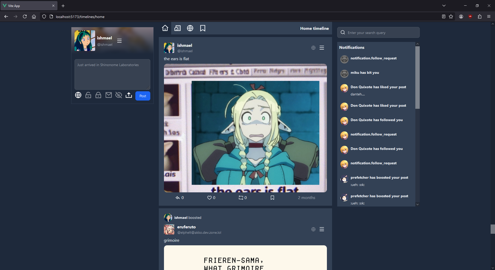

<p align="center">
	<b>Toki</b><br>
	<span>n. (toki pona) - communication, speech</span>
</p>

<hr>



A C# ActivityPub Fediverse-compatible server designed mostly for small-ish instances.

I'm working on it as sort of a personal challenge, considering I've always wanted to implement the ActivityPub protocol.

While Toki has its own frontend called [luka](https://github.com/purifetchi/luka), it supports the Mastodon API protocol, allowing it to be used with your favorite client.

Do note that Toki isn't considered truly stable for the time being, and while it is very much usable for usage, it might still undergo changes.

## Usage

Toki doesn't have an admin panel *yet*. There are plans to make one and the required steps are outlined in the [Administration Roadmap issue](https://github.com/purifetchi/Toki/issues/11). (If anyone would want to help out with it, I'd be insanely thankful...)

### Running Toki for the first time

Firstly, make sure that the .NET 8 runtime is installed, alongside Docker.

1. Clone the repository to a directory of your choice.

2. Inside of the repository, run `docker compose up -d` to initialize and run all of the docker containers required by Toki.

3. After that, navigate to the `Toki.Admin` repository.

4. Inside of there, execute `dotnet run <path to appsettings.json> setup` to perform the first-time setup.

	a. NOTE: The `appsettings.json` file is located in the `Toki` folder, and the path to it must be absolute. (that is, if the folder of the `Toki` folder is `/opt/toki/Toki`, the path to `appsettings.json` would be `/opt/toki/Toki/appsettings.json`)

	b. NOTE 2: You **must** create the directory you've specified as the upload directory. Toki doesn't do it automatically.

5. Navigate to the `Toki` directory. From there run `dotnet run --configuration Release --auto-migrate` to perform the neccessary migrations and run Toki for the first time.

Toki should now be up and running!

### Updating Toki

In order to update an already existing version of Toki, you must:

1. Stop the currently running Toki instance

2. Navigate to the root of the git repository and `git pull` the latest changes.

3. Navigate to the `Toki` directory and from there run `dotnet run --configuration Release --auto-migrate`. This will automatically perform the database migrations (if any happened).

### Installing Luka

By default Toki doesn't launch with a frontend. Unlike Pleroma/Akkoma we don't support installing frontends from the admin panel yet, but manual installation is still possible.

As a prerequisite, the latest version of Node.JS is required.

1. Clone [luka](https://github.com/purifetchi/luka) into a directory of your choice.

2. Navigate to the luka folder.

3. Inside of the luka git repository, navigate to `src/config` and inside of the `config.js` file, edit it to point to the domain of your Toki instance.

4. Run `npm install` to install all of the required packages.

5. Run `npm run build` to build the release version of Luka.

6. Copy all of the files from the `dist` folder to `<toki git repo>/Toki/wwwroot`.

7. In the `appsettings.json` file, add (or modify if it already exists) the following section:

```json

"Frontend": {
	"Enabled": true,
	"SpaFilename": "index.html"
}

```

7. Restart Toki, and luka should be already running!

### Importing emojis from packs

As a prerequisite, the emojis should be packed in a zip file without any subdirectories with the names `<the emoji name you want>.<extension>`.

If you already have the zip file ready:

1. Navigate to the `Toki.Admin` folder.

2. From there, execute `dotnet run <path to appsettings.json> importemojipack --path <path to your zip file>`. Toki should automatically extract the emojis and add them to the database.

3. Restart Toki, and enjoy your emojis!


## Modules

**Toki** contains the server & Web backend. 

**Toki.ActivityPub** contains all of the ActivityPub related logic, like the models, and various resolvers. 

**Toki.ActivityStreams** contains the ActivityStreams implementation.

**Toki.HTTPSignatures** contains our HTTP signatures implementation.

## Contributing Guide

If you'd really want to contribute to this project (thank you!) please adhere to the [Conventional Commits](https://www.conventionalcommits.org/en/v1.0.0/) commit format as much as you can.

## Requirements

* .NET 8
* PostgreSQL (as the database)
* Redis (for the job queue)